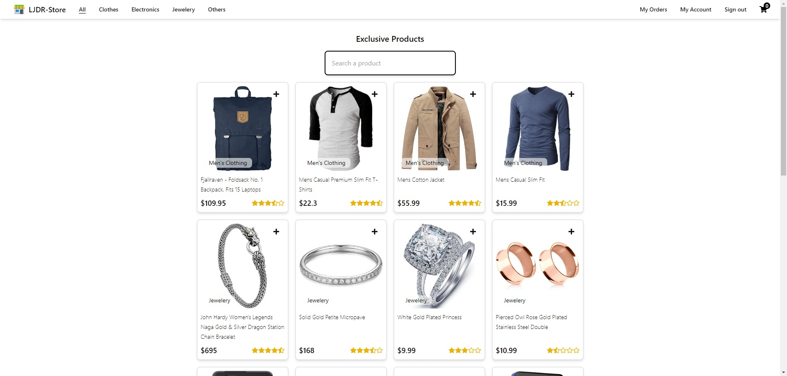

# LJDR-Store

## Descripción

LJDR-Store es una tienda en línea desarrollada con React, Vite y Tailwind CSS. Utiliza React Router para la navegación y React Portal para la gestión de modales. La aplicación se conecta a la [Fake Store API](https://fakestoreapi.com/) para obtener datos de productos.

## Imágenes

- **Inicio:**
  
- **Iniciar Sesión:**
  
- **Registrarse:**
  
- **Mi Cuenta:**
  
- **Editar Cuenta:**
  
- **Eliminar Cuenta:**
  
- **Menú Lateral del Proceso de Pago:**
  
- **Detalle del Producto:**
  
- **Mis Pedidos:**
  
- **Detalle de Pedido:**
  

## Tabla de Contenidos

- [Instalación](#instalación)
- [Uso](#uso)
- [Funcionalidades](#funcionalidades)
- [Tecnologías Utilizadas](#tecnologías-utilizadas)
- [Licencia](#licencia)

## Instalación

1. Clona el repositorio:

   ```sh
   git clone https://github.com/ljdr64/mystore-react-vite.git
   ```

2. Navega al directorio del proyecto:

   ```sh
   cd mystore-react-vite
   ```

3. Instala las dependencias:
   ```sh
   npm install
   ```

## Uso

1. Inicia el servidor de desarrollo:

   ```sh
   npm run dev
   ```

2. Abre tu navegador y navega a `http://localhost:5173`.

## Funcionalidades

- **Inicio**: Página principal que muestra todos los productos disponibles.
- **Catálogo de Productos**: Página que lista todos los productos disponibles con opciones de filtrado y búsqueda.
- **Detalle del Producto**: Página de detalles de un producto específico con descripción, imágenes y opciones de compra.
- **Carrito de Compras**: Carrito interactivo donde los usuarios pueden añadir, eliminar y actualizar productos.
- **Sign In**: Página para que los usuarios inicien sesión en su cuenta.
- **Sign Up**: Página para que los usuarios creen una nueva cuenta.
- **Mi Cuenta**: Página donde los usuarios pueden ver y gestionar su información de cuenta.
- **Editar Cuenta**: Página donde los usuarios pueden editar su información de cuenta.

## Tecnologías Utilizadas

- **React**
- **Vite**
- **Tailwind CSS**
- **React Router**
- **React Icons**
- **Fake Store API**
- **Local Storage**

## Licencia

Este proyecto está licenciado bajo la Licencia MIT. Consulta el archivo [LICENSE](LICENSE) para obtener más detalles.
